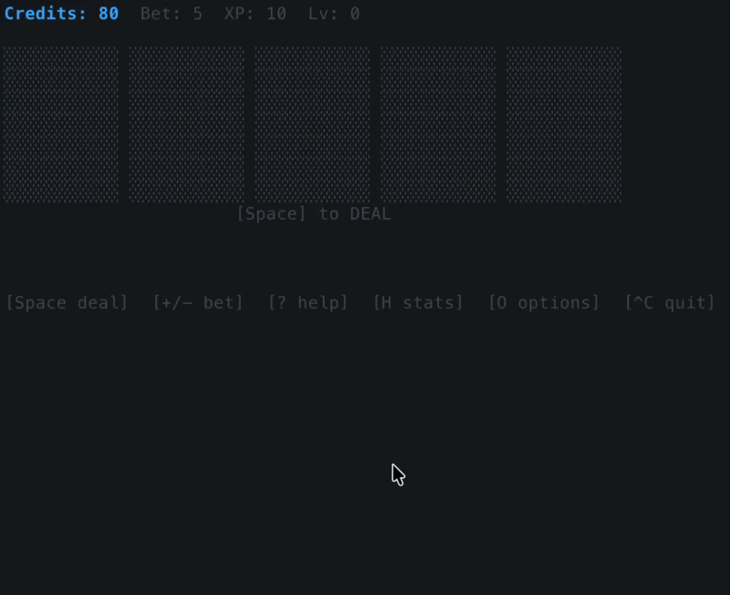

# poker_tui

A terminal-based Video Poker game (Jacks-or-Better) with gamble mode, XP/levelling, stats, and full session persistence.


## Tech Stack

- **Go 1.24.2**: Core language for all logic and UI
- **Bubble Tea**: Terminal UI framework for interactive views
- **Lipgloss**: Terminal styling for colors, borders, and layouts
- **go-runewidth**: Unicode width handling for card rendering
- **POSIX flock**: Multi-instance lock for safe persistence
- **GitHub Actions**: CI/CD for cross-platform builds and artifact uploads


## Gameplay Demo



## Controls

| Key | Action |
|-----|--------|
| `Space` | Deal (idle) / Draw (holding phase) / Next hand (after result) |
| `1`–`5` | Toggle HOLD for card at that position |
| `Q` | Gamble after a win |
| `1` / `2` | Red / Black guess in gamble mode |
| `C` | Collect winnings during gamble |
| `+` / `-` | Increase / decrease bet (1–50, idle only) |
| `?` | Help overlay (keybinds + paytable + gamble rules) |
| `H` | Stats / high score screen |
| `O` | Options menu (card design, theme, auto-hold, reset progress) |
| `^C` | Quit (auto-saves) |

## Paytable (Jacks-or-Better, 9/6)

| Hand | Multiplier |
|------|------------|
| Royal Flush | 800× |
| Straight Flush | 50× |
| Four of a Kind | 25× |
| Full House | 9× |
| Flush | 6× |
| Straight | 4× |
| Three of a Kind | 3× |
| Two Pair | 2× |
| Jacks or Better | 1× |

## Gamble Mode

After a win, press `Q` to gamble your winnings. A card is drawn face-up; guess Red (`1`) or Black (`2`):
- Correct → pot doubles (up to 5 stages, maximum ×32).
- Wrong → winnings are lost.
- Press `C` at any stage to collect your current pot.

## Winning Card Highlight

When a winning hand is resolved, the cards that form the winning combination are highlighted with a **bright green border and background tint** so you can see exactly which cards won.

## Auto-Hold

Enable **Auto-Hold** in the Options menu to automatically hold high cards (Jack or better) and any paired/tripped/quaded cards after the deal. You can still manually adjust holds before drawing.

## Building

```bash
# Quick build script
./build.sh

# Run directly
make run

# Build binary
make build

# Cross-compile
make build-linux
make build-windows
```

## Persistence

Progress (credits, bet, XP, level, stats, options, and the exact game state including mid-hand and mid-gamble) is saved automatically to:

- **macOS/Linux**: `~/.config/poker_tui/save.json`

## Multi-instance

Opening a second terminal runs in **read-only** mode — no saves, clearly labelled. The lock prevents save corruption.

## Card Designs

Select in Options (`O`):

| Design | Size | Description |
|--------|------|-------------|
| `classic` | 11×7 | Single centered suit symbol |
| `minimal` | 9×5 | Compact single-suit |
| `wide` | 15×9 | Large single-suit with extra padding |

## Themes

Select in Options (`O`): `dark`, `amber`, `green`, `mono`.

## Installation

To install the game system-wide so you can launch it from any terminal:

```bash
./install.sh
```

This will:
- Build the binary if needed
- Copy it to `/usr/local/bin/poker_tui`
- Create a `ptui` alias (`/usr/local/bin/ptui`)

You can then run:

```
poker_tui
# or
ptui
```
from any terminal.
